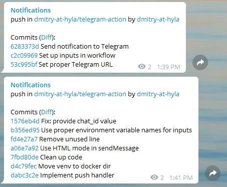

# Telegram Notifier

[](https://github.com/dmitry-at-hyla/telegram-action/actions)

Github action to send notification to Telegram about Github events.



## Usage

```yml
name: Telegram Notifications
on: [push]
jobs:
  build:
    name: Build
    runs-on: ubuntu-latest
    steps:
    - uses: actions/checkout@master
    - uses: dmitry-at-hyla/telegram-action@master
      with:
        destination: ${{ secrets.TELEGRAM_TO }}
        token: ${{ secrets.TELEGRAM_TOKEN }}
```

## Supported Event

* push
* pull_request
* pull_request_review
* issues
* issue_comment
